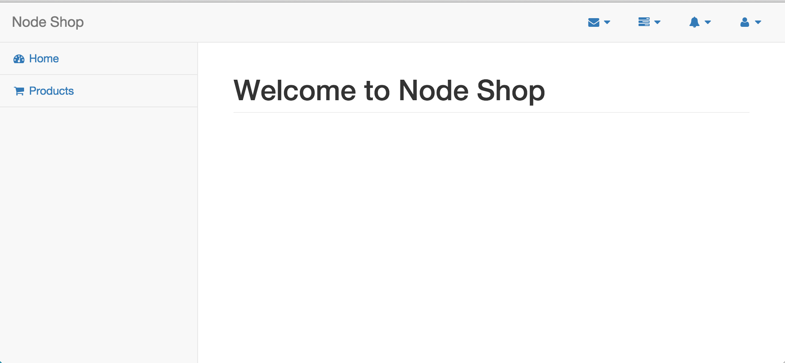

nodeshop
========
A simple nodejs project using sails framework and reactJS to build some part of UI.

# Project Design 

Trello https://trello.com/b/OzGFluYs/node-shop

# Docs

- [readme](docs/readme.md) Readme for codes
- [install](docs/install.md) How to install
- [shell](docs/shell.md) Shell scripts for this project

# Preview

- Homepage

- Login menu

- Login

- Nagivation

- Product list

- Order product

- Order product with image one

- After checkout

- Order details

- Login as admin

- Admin menu

